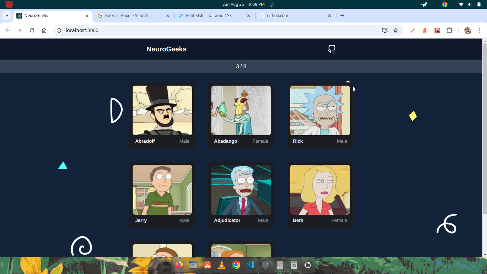

# Memory Game



## General description

- This game is super simple that all you have to do it click a card once.

- The construct of the game play is to click a card once and do not click it again.

## Preview

Here is the live [link]()

## Features
- rotate card randomization
- card count
- game guide
- ballons when win criteria is met

## Getting started

1. Clone the repo
```
$ git clone git@github.com:Mtendekuyokwa19/memory-game.git

```
2. Move into the repo
```
$ cd memory-game/

```

3. install the dependencies
```
$ npm install

```
4. finally run it

```
$ npm start

```

## Tools and technologies
1. Typescript
1. Javascript
1. tailwind css
1. vanilla css
1. figma
1. React TS
1. git

## Motivation
- Understanding how to use the `useEffect` react hook.